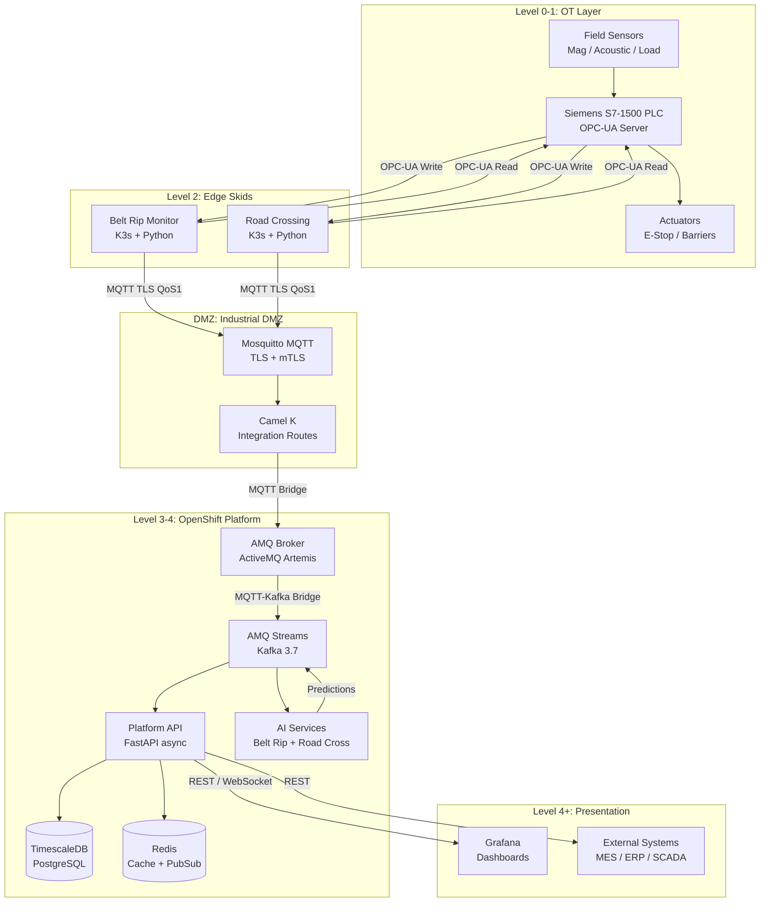

# Flux OT Platform — System Overview

**Version:** 1.0  
**Audience:** Enterprise Customers, Implementation Partners, Solution Architects  
**Classification:** Internal / Partner-Confidential

---

## Table of Contents

1. [Executive Summary](#1-executive-summary)
2. [Design Principles](#2-design-principles)
3. [Purdue Model Mapping](#3-purdue-model-mapping)
4. [High-Level Architecture](#4-high-level-architecture)
5. [Key Components](#5-key-components)
6. [Data Flow Overview](#6-data-flow-overview)
7. [Scalability Model](#7-scalability-model)
8. [Cost Model](#8-cost-model)
9. [Standards Compliance](#9-standards-compliance)
10. [Supported Use Cases](#10-supported-use-cases)

---

## 1. Executive Summary

**Flux OT** is an industrial IoT IT/OT integration platform purpose-built for the mining and oil & gas sectors. It bridges the air-gap between plant-floor operational technology (OT) equipment—PLCs, DCS systems, sensors, actuators—and modern enterprise IT infrastructure including cloud analytics, AI/ML services, and business intelligence dashboards.

### Key Value Propositions

| Capability | Description |
|---|---|
| **Bidirectional integration** | Read telemetry from field devices AND write setpoints/commands back via OPC-UA and Modbus—not just passive monitoring |
| **AI-enhanced safety** | On-skid rule-based detection augmented by cloud ML models for belt rip prevention and autonomous road crossing |
| **Industrial-grade reliability** | Offline buffering, exponential-backoff reconnection, QoS-guaranteed messaging, and hardware watchdogs ensure no data loss even during WAN outages |
| **OpenShift-native** | All platform services run as Kubernetes workloads on Red Hat OpenShift, enabling enterprise-standard CI/CD, RBAC, image scanning, and operator lifecycle management |
| **Open standards** | OPC-UA (IEC 62541), Modbus, MQTT, Kafka, PostgreSQL—no proprietary lock-in at any layer |
| **IEC 62443 alignment** | Defense-in-depth cybersecurity architecture targeting Security Level 2 (SL2) across all zones |
| **Australian mining focus** | Timezone handling, regulatory alignment (Mines Safety and Inspection Act 1994, WA Mining Regulations 1995), and site-tested reference architectures |

### Target Industries

- **Hard-rock mining** — gold, iron ore, copper, lithium
- **Coal mining** — underground and open-cut
- **Oil & gas** — upstream processing facilities, pipeline infrastructure
- **General bulk materials handling** — ports, grain terminals, cement plants

---

## 2. Design Principles

### 2.1 Industrial-Grade Reliability

Every component is designed for 99.9%+ uptime in harsh industrial environments:

- Edge services maintain a **1,000-message ring buffer** and flush on reconnect—no telemetry loss during transient WAN failures
- All platform services run with **minimum 2 replicas** on separate Kubernetes nodes
- **Database WAL archiving** provides point-in-time recovery for TimescaleDB
- **Last Will and Testament (LWT)** MQTT messages alert the platform immediately when an edge skid goes offline

### 2.2 Defense in Depth

Security is not a single control but a layered strategy:

- Physical security of edge hardware (IP65+ enclosures, tamper detection)
- Network segmentation (OT, DMZ, IT zones with firewall ACLs)
- Host hardening (RHEL 9 SELinux, CIS benchmark)
- Application authentication (JWT, mTLS, SCRAM)
- Data encryption at rest and in transit (AES-256, TLS 1.3)

### 2.3 IT/OT Separation

Flux OT enforces strict zone boundaries following the Purdue Enterprise Reference Architecture:

- **No direct connectivity** from IT systems to Level 0-2 OT systems
- Edge services act as **unidirectional data diodes** for telemetry (OT → IT)
- Writeback commands flow through **validated, audited command queues** with operator approval gates
- The **DMZ MQTT broker** is the only point of controlled bidirectional data exchange

### 2.4 ISA-95 Alignment

Data models and APIs align with ISA-95 (IEC 62264) Manufacturing Operations Management standards:

- Site → Area → Line → Unit → Control Module hierarchy maps to ISA-95 Physical Model
- Equipment status values (RUNNING, STOPPED, MAINTENANCE, ALARM) follow ISA-88 batch state machine concepts
- Production data interfaces use ISA-95 Part 2 schemas for interoperability with MES/ERP systems

### 2.5 Open Standards

No proprietary protocols at any layer:

| Layer | Protocol |
|---|---|
| Field → Edge | OPC-UA (IEC 62541), Modbus TCP/RTU |
| Edge → Platform | MQTT 5.0 over TLS 1.3 |
| Platform internal | Apache Kafka (AMQP), REST/HTTP/2, WebSocket |
| Storage | PostgreSQL (TimescaleDB) |
| Observability | Prometheus, OpenTelemetry |

---

## 3. Purdue Model Mapping

The Purdue Enterprise Reference Architecture (PERA) defines 5 levels of industrial automation. Flux OT is designed to operate across all levels while enforcing strict security boundaries between them.

```
┌──────────────────────────────────────────────────────────────────────────┐
│  LEVEL 4/5  — Enterprise / Cloud                                         │
│  ┌────────────────────────────────────────────────────────────────────┐  │
│  │  Grafana Dashboards  │  Business Intelligence  │  ERP Integration  │  │
│  │  AI/ML Training      │  TimescaleDB (OLAP)     │  Regulatory Reports│ │
│  └────────────────────────────────────────────────────────────────────┘  │
│                              OpenShift Platform                           │
├──────────────────────────── FIREWALL ────────────────────────────────────┤
│  LEVEL 3  — Site Operations                                               │
│  ┌────────────────────────────────────────────────────────────────────┐  │
│  │  Platform API (FastAPI)  │  Kafka (AMQ Streams)  │  Redis Cache   │  │
│  │  AI Inference Services   │  AMQ Broker (MQTT)    │  TimescaleDB   │  │
│  └────────────────────────────────────────────────────────────────────┘  │
│                              OpenShift Platform                           │
├──────────────────────────── DMZ ─────────────────────────────────────────┤
│  DMZ  — Industrial DMZ                                                    │
│  ┌────────────────────────────────────────────────────────────────────┐  │
│  │  Eclipse Mosquitto MQTT Broker  │  Camel K Integration Routes     │  │
│  │  MQTT-Kafka Bridge Service      │  Certificate Authority          │  │
│  └────────────────────────────────────────────────────────────────────┘  │
├──────────────────────────── FIREWALL ────────────────────────────────────┤
│  LEVEL 2  — Control Layer (Edge)                                          │
│  ┌──────────────────────────┐  ┌──────────────────────────────────────┐  │
│  │  Belt Rip Monitor Skid   │  │  Road Crossing Skid                  │  │
│  │  K3s + Python services   │  │  K3s + Python services               │  │
│  │  OPC-UA client           │  │  OPC-UA client + Decision Engine     │  │
│  │  Magnetic/Acoustic/Load  │  │  Loop detectors/Radar/LiDAR          │  │
│  └──────────────────────────┘  └──────────────────────────────────────┘  │
├──────────────────────────── OT NETWORK ──────────────────────────────────┤
│  LEVEL 1  — Basic Process Control                                         │
│  ┌──────────────────────────────────────────────────────────────────────┐│
│  │  Siemens S7-1500 PLCs  │  Allen-Bradley CLX  │  Emerson DeltaV DCS ││
│  │  Schneider Modicon     │  OPC-UA Servers      │  Modbus RTU/TCP     ││
│  └──────────────────────────────────────────────────────────────────────┘│
├──────────────────────────── FIELD NETWORK ───────────────────────────────┤
│  LEVEL 0  — Physical Process                                              │
│  ┌──────────────────────────────────────────────────────────────────────┐│
│  │  Belt conveyors, Haul trucks, Pumps, Valves, Sensors, Actuators     ││
│  │  Magnetic sensors, Acoustic transducers, Load cells, Loop detectors ││
│  └──────────────────────────────────────────────────────────────────────┘│
└──────────────────────────────────────────────────────────────────────────┘
```

### Zone Security Policies

| Zone | Security Posture | Inbound | Outbound |
|---|---|---|---|
| Level 0-1 | Air-gapped OT network | Only from Level 2 edge (OPC-UA writeback) | OPC-UA data to Level 2 only |
| Level 2 Edge | Hardened IPC, minimal attack surface | MQTT commands from DMZ | MQTT telemetry to DMZ |
| DMZ | Strict firewall both sides | MQTT from Level 2 edge | MQTT to Level 3 broker only |
| Level 3 Platform | OpenShift NetworkPolicies | MQTT from DMZ, REST from Level 4 | REST/WS to Level 4 dashboards |
| Level 4+ | Enterprise IT standards | REST from user workstations | None (outbound to internet restricted) |

---

## 4. High-Level Architecture



---

## 5. Key Components

| Component | Technology | Purpose | Vendor / Project |
|---|---|---|---|
| Edge Runtime | K3s v1.29 | Lightweight Kubernetes for IPC | Rancher / SUSE |
| Edge Service | Python 3.12, asyncio | Belt rip and road crossing logic | Custom (Flux OT) |
| OPC-UA Client | asyncua 1.x | Bidirectional PLC integration | FreeOpcUa OSS |
| Modbus Client | pymodbus 3.x | Legacy device integration | riptide-io OSS |
| Edge MQTT Client | paho-mqtt 2.x | TLS MQTT with offline buffer | Eclipse Foundation |
| DMZ Broker | Eclipse Mosquitto 2.x | MQTT broker in DMZ | Eclipse Foundation |
| Platform Broker | AMQ Broker 7.x (Artemis) | Enterprise MQTT / AMQP | Red Hat |
| Message Bus | AMQ Streams (Kafka 3.7) | High-throughput event streaming | Red Hat / Apache |
| Platform API | FastAPI 0.111 + Uvicorn | Async REST + WebSocket API | Sebastián Ramírez OSS |
| Time-Series DB | TimescaleDB 2.x on PostgreSQL 16 | Industrial telemetry storage | Timescale Inc. |
| Cache / PubSub | Redis 7.x | Real-time WebSocket fan-out | Redis Ltd. |
| Integration | Camel K 2.x | ETL / protocol mediation | Apache / Red Hat |
| AI/ML Platform | MLflow + scikit-learn + PyTorch | Model lifecycle + inference | Databricks / Meta |
| Container Platform | Red Hat OpenShift 4.14+ | Enterprise Kubernetes | Red Hat |
| Observability | Prometheus + Grafana | Metrics, dashboards, alerting | CNCF / Grafana Labs |
| Certificate Mgmt | cert-manager 1.14 | Automatic TLS certificate rotation | CNCF |
| Secret Mgmt | SealedSecrets / Vault | GitOps-safe secret management | Bitnami / HashiCorp |

---

## 6. Data Flow Overview

### 6.1 Telemetry Path (OT → IT, ~500 ms end-to-end)

```
Sensor (physical)
  → PLC OPC-UA Server (Level 1, 100 ms scan)
  → Edge OPC-UA Client (Level 2, 500 ms poll)
  → Edge Service (anomaly check, local rule evaluation)
  → MQTT QoS 1 → Mosquitto DMZ Broker
  → MQTT Bridge → AMQ Broker (Artemis)
  → MQTT-Kafka Bridge → Kafka topic: fluxot.telemetry.<skid_type>
  → Kafka Consumer → Platform API /ingest
  → TimescaleDB hypertable: telemetry_records
  → Redis pub/sub → WebSocket → Grafana dashboard
```

### 6.2 Command / Writeback Path (IT → OT, operator-initiated)

```
Grafana / API client
  → POST /api/v1/sites/{site_id}/skids/{skid_id}/commands
  → Platform API (authorization check, audit log)
  → Kafka topic: fluxot.commands.<skid_id>
  → MQTT command topic: fluxot/{site}/{type}/{skid}/commands
  → Edge Service (validation, safety interlock check)
  → OPC-UA WriteRequest → PLC
  → Actuator response
  → MQTT writeback-audit topic → Platform API audit log
```

### 6.3 AI Prediction Path

```
TimescaleDB (feature window, last 5 minutes)
  → AI Service (batch feature extraction)
  → ML inference (Random Forest / LSTM)
  → Kafka topic: fluxot.predictions.<skid_type>
  → Platform API (persist prediction)
  → Edge Service (threshold comparison)
  → Safety action if score > threshold
```

---

## 7. Scalability Model

Flux OT is designed to scale from a single pilot skid to fleet-wide deployments across multiple sites.

### Horizontal Scaling

| Component | Scaling Mechanism | Notes |
|---|---|---|
| Edge Skids | Independent K3s instances | Each skid is a fully autonomous unit |
| Kafka | Add brokers to AMQ Streams cluster | Rebalancing is automatic via partition reassignment |
| Platform API | OpenShift HPA (CPU/memory) | Stateless workers, Redis session state |
| TimescaleDB | Read replicas for analytics queries | Write path stays on primary |
| AI Inference | Multiple replica pods behind a Service | Stateless inference, model loaded from PVC |
| Redis | Redis Cluster mode (6 nodes, 3 primary + 3 replica) | For >10,000 concurrent WebSocket connections |

### Capacity Benchmarks (Reference Architecture)

| Skid Count | Kafka Messages/sec | TimescaleDB Insert Rate | OpenShift Workers Needed |
|---|---|---|---|
| 1–10 | ~200 msg/s | ~2,000 rows/min | 3 × 4 vCPU / 16 GB |
| 10–50 | ~1,000 msg/s | ~10,000 rows/min | 3 × 8 vCPU / 32 GB |
| 50–200 | ~4,000 msg/s | ~40,000 rows/min | 5 × 16 vCPU / 64 GB |
| 200–500 | ~10,000 msg/s | ~100,000 rows/min | 7 × 16 vCPU / 128 GB + dedicated DB nodes |
| 500–1,000+ | ~20,000 msg/s | ~200,000 rows/min | Multi-cluster federation |

### Multi-Site Architecture

For enterprises with multiple mine sites, Flux OT supports a hub-and-spoke topology:

- Each site has an **autonomous edge cluster** capable of operating standalone
- A **central platform cluster** (per region or cloud) aggregates data from all sites
- **Kafka MirrorMaker 2** replicates topics cross-cluster
- Sites can be added without downtime by deploying additional edge skids and registering them via the Platform API

---

## 8. Cost Model

### OpenShift Cluster Node Requirements

| Tier | Skid Count | Control Plane | Worker Nodes | Est. AWS Monthly* |
|---|---|---|---|---|
| **Starter** | 1–5 skids | 3 × m5.xlarge (4vCPU/16GB) | 3 × m5.2xlarge (8vCPU/32GB) | ~AUD $3,500 |
| **Standard** | 5–50 skids | 3 × m5.2xlarge | 5 × m5.4xlarge (16vCPU/64GB) | ~AUD $9,000 |
| **Enterprise** | 50–200 skids | 3 × m5.4xlarge | 7 × m5.4xlarge + 2 × r5.4xlarge (DB) | ~AUD $22,000 |
| **Fleet** | 200–500+ skids | 3 × m5.8xlarge | 10+ × m5.4xlarge + dedicated Kafka cluster | ~AUD $45,000+ |

*Estimates include compute only. Add ~20% for storage (EBS gp3, S3 archival) and ~10% for data transfer. OpenShift subscription (Red Hat) is additional. Prices as of 2024, subject to change.

### Azure Equivalent Sizing

Replace AWS instance types with Azure equivalents:
- m5.xlarge → Standard_D4s_v5
- m5.2xlarge → Standard_D8s_v5
- m5.4xlarge → Standard_D16s_v5
- r5.4xlarge → Standard_E16s_v5 (memory-optimised for TimescaleDB)

### On-Premises Sizing

For air-gapped or sovereign deployments on bare metal or VMware:
- Use the same vCPU/RAM ratios as above
- Add 20% overhead for hypervisor and OS
- Minimum 10 GbE networking between nodes
- Shared NFS or Ceph for persistent storage (Rook-Ceph recommended)

---

## 9. Standards Compliance

### IEC 62541 (OPC-UA)

Flux OT implements OPC-UA as a client using the `asyncua` library. Compliance points:

- **Security policies:** None (dev/test only), Basic256Sha256 (production minimum), Aes128Sha256RsaOaep (high-security)
- **Security modes:** Sign, SignAndEncrypt (production)
- **Session keepalive:** 20-second server state polling
- **Certificate management:** X.509v3 certificates, managed by cert-manager

### IEC 62443 (Industrial Cybersecurity)

Target: **Security Level 2 (SL2)** — protection against intentional violation using simple means with low resources.

| IEC 62443 Component | Implementation |
|---|---|
| 62443-2-1: Security Management System | Risk assessment, policy, training program |
| 62443-3-2: Security Risk Assessment | Zone/conduit model, threat analysis |
| 62443-3-3: System Security Requirements | SR 1.x–SR 7.x mapped to technical controls |
| 62443-4-1: Secure Development Lifecycle | Threat modeling, SAST, dependency scanning |
| 62443-4-2: Component Security Requirements | CR requirements for edge and platform components |

### ISA-95 (Manufacturing Enterprise Integration)

- **Part 1:** Physical Model mapping (Site → Area → ProcessCell → Unit)
- **Part 2:** Object model for equipment and production capability
- **Part 3:** Activity models for manufacturing operations

### ISA-99 (Industrial Automation and Control Systems Security)

ISA-99 is the precursor to IEC 62443 and all ISA-99 recommendations are implemented through the IEC 62443 controls above.

---

## 10. Supported Use Cases

| Use Case | Skid Type | Industry | Maturity |
|---|---|---|---|
| Belt rip detection and emergency stop | Belt Rip Monitor | Mining, Bulk Materials | GA (General Availability) |
| Autonomous haul road crossing | Road Crossing | Mining | GA |
| Belt speed and tension monitoring | Belt Rip Monitor | Mining, Bulk Materials | GA |
| Drive motor current anomaly detection | Belt Rip Monitor | Mining | GA |
| Vehicle queue management | Road Crossing | Mining | GA |
| Conveyor throughput optimisation | Belt Rip Monitor | Mining | Beta |
| Predictive belt maintenance scheduling | Belt Rip Monitor | Mining | Beta |
| Energy consumption optimisation | Belt Rip Monitor | Mining, Oil & Gas | Roadmap |
| Pipeline pressure anomaly detection | Generic Skid | Oil & Gas | Roadmap |
| Pump vibration monitoring | Generic Skid | Mining, Oil & Gas | Roadmap |
| Autonomous vessel loading | Custom Skid | Ports, Mining | Roadmap |
